# Ledger Write-up (FR/EN)

[🇫🇷 Version française](ledger.md#francais) | [🇬🇧 English version](ledger.md#english)

## English

**Category:** Active Directory\
**Platform:** TryHackMe\
**Goal:** The **Ledger** machine simulates an Active Directory environment where the attacker must enumerate users via LDAP, exploit default passwords to gain an initial user foothold, and then escalate privileges by abusing a misconfiguration in Active Directory Certificate Services (ADCS). The final objective is to obtain a certificate that allows authentication as **Administrator**.

***

### 1. Nmap Scan – What does the infrastructure hold?

Before jumping into the flashy tools, we keep it classic: a good old Nmap scan to lay the foundation of our understanding.

```bash
nmap -sC -sV -Pn -T4 -p- <IP>
```

<p align="center"><a href="../../images/Ledger/nmap_output.png">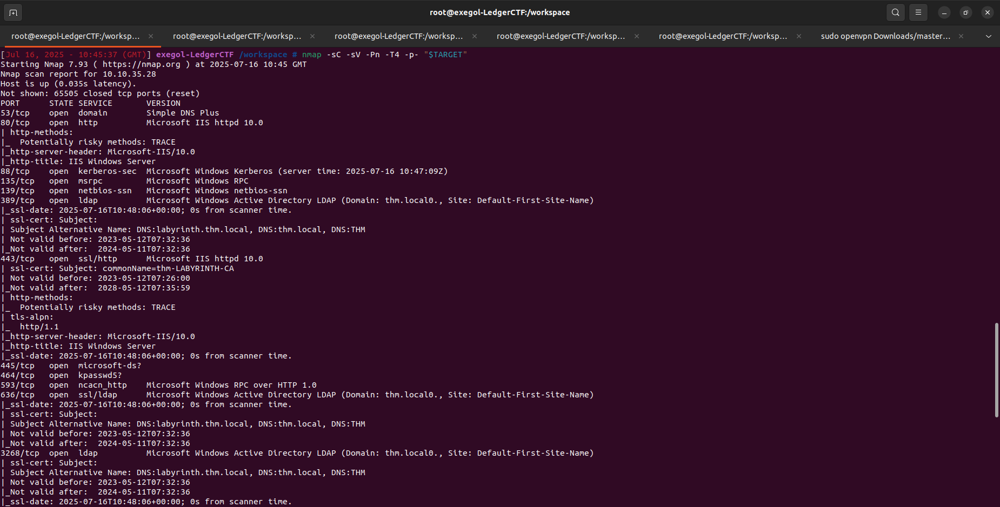</a></p>

***

#### **1.1 Exegol-history**

`exegol-history` is a mechanism or module often used in the Exegol environment, a Docker offensive container designed for pentesters and Red Teamers. It allows customization of the working session in the container, notably by loading environment variables when opening an Exegol terminal.

Its main benefit is the automatic pre-configuration of sensitive or useful variables for each engagement, such as:

```
TARGET : name or IP of the target

DOMAIN : Active Directory domain being attacked

USERNAME : compromised account during the pentest

PASSWORD : associated account password

...
```

<p align="center"><a href="../../images/Reset/exegol_history.png">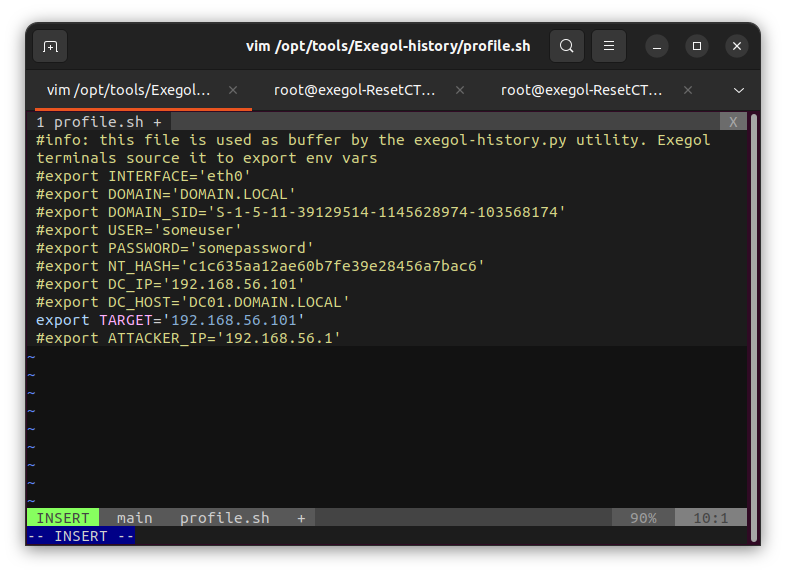</a></p>

This avoids retyping them each time, allows use in scripts/tools (NetExec, Impacket, etc.), and standardizes environments across operators.

***

**📡 Open Ports – Initial Analysis**

Here are the ports detected by Nmap, with a quick analysis of potential opportunities:

| Port | Service  | Interpretation / Action                         |
| ---- | -------- | ----------------------------------------------- |
| 53   | DNS      | 🔎 **Test for zone transfer**                   |
| 80   | HTTP     | 🌐 **Web investigation** (classic site?)        |
| 88   | Kerberos | 🔓 **ASREPRoasting** if usernames are known     |
| 135  | RPC      | 📤 Enumeration via **rpcdump**                  |
| 139  | NetBIOS  | 📂 Enumeration with **smbmap**/**enum4linux**   |
| 445  | SMB      | 📂 Potential shares, rights, SMB enumeration    |
| 389  | LDAP     | 🧬 **ldapsearch** to extract accounts           |
| 443  | HTTPS    | 🌐 **Secure web version**, worth checking out   |
| 3389 | RDP      | 🔐 **Remote access** if valid credentials exist |

We leak:

* The Domain name --> `thm.local`
* The machine's FQDN --> `labyrinth.thm.local`

### 2. DNS – Can we extract info easily?

A little zone transfer test — often overlooked but sometimes quite revealing:

<p align="center"><a href="../../images/Ledger/dig.png">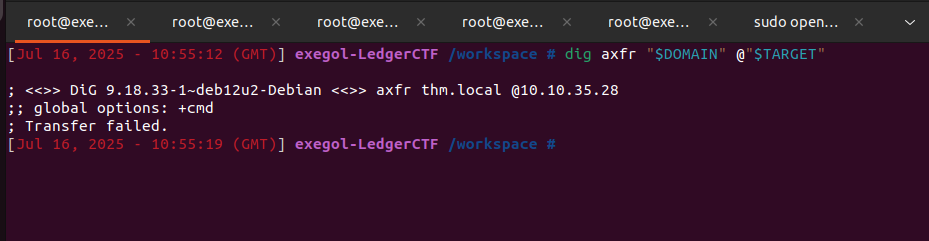</a></p>

❌ Failed.

No worries, let’s hunt for intel elsewhere.

***

### 3. HTTP/HTTPS – Any hope on the web?

We head to port 80 (HTTP) then 443 (HTTPS). The site shows a default IIS landing page.

<p align="center"><a href="../../images/Ledger/IIS.png">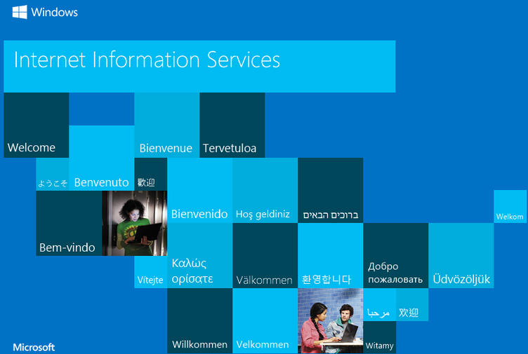</a></p>

***

### 4. SMB/RPC – Juicy shares?

<p align="center"><a href="../../images/Ledger/enum4linux.png">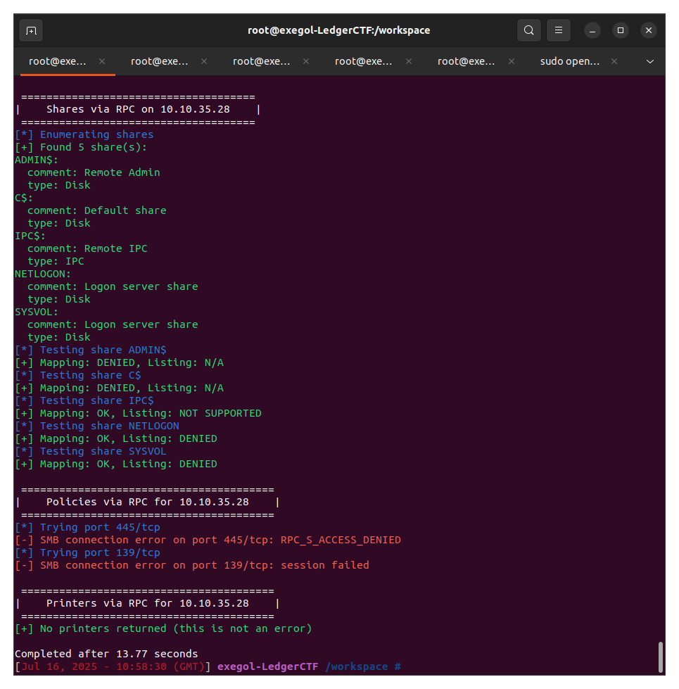</a></p>

❌ Nothing useful. Looks like authentication is required to get anything valuable. Let’s revisit later.

***

### 5. LDAP – The Rare Gem?

<p align="center"><a href="../../images/Ledger/ldapsearch.png">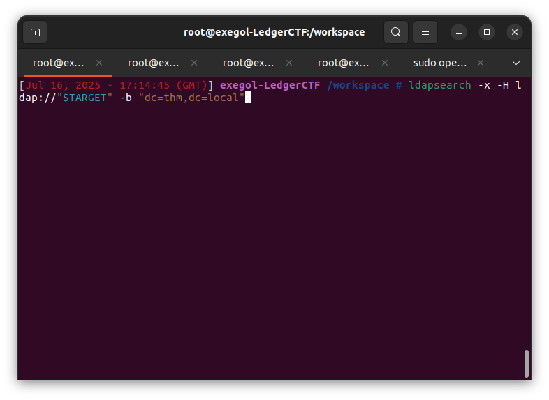</a></p>

We grep the output with `description`

<p align="center"><a href="../../images/Ledger/ldapdump.png">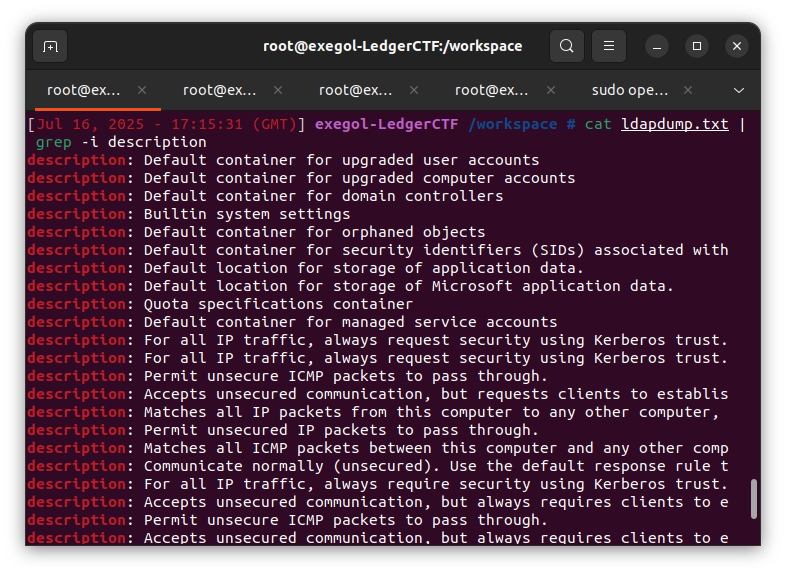</a></p>

Then, scrolling down a bit, we notice:

<p align="center"><a href="../../images/Ledger/ldapdump_description.png">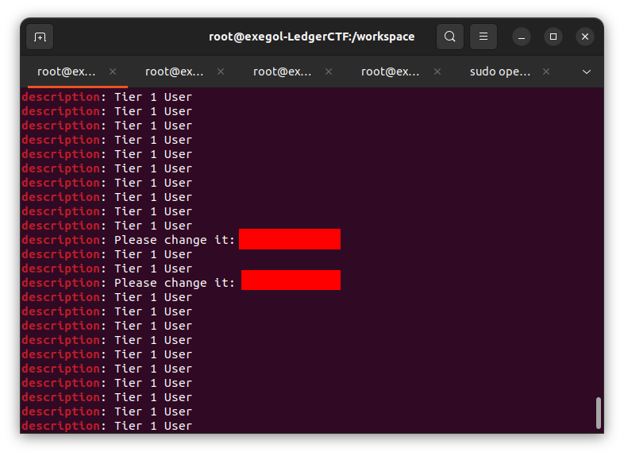</a></p>

We extract the users associated with this default password

<p align="center"><a href="../../images/Ledger/ldapdump_users.png">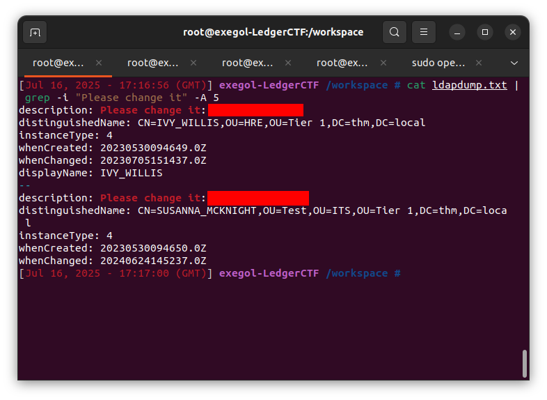</a></p>

💥 Bingo! Two users appear with the same default password:

IVY\_WILLIS

SUSANNA\_MCKNIGHT

***

### 6. RDP – A Gateway to the System?

We test the possibility that the users found previously can connect via RDP:

<p align="center"><a href="../../images/Ledger/nxc_fail.png">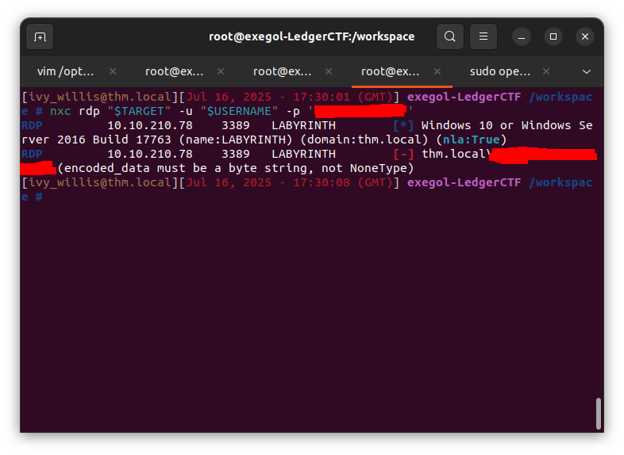</a></p>

<p align="center"><a href="../../images/Ledger/nxc_success.png">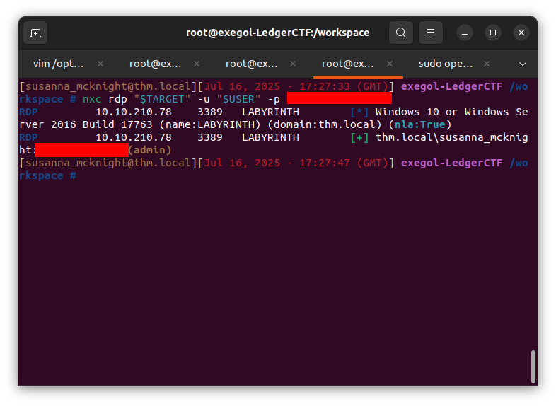</a></p>

Then we connect with the user who can establish an RDP session with the machine

<p align="center"><a href="../../images/Ledger/rdp.png">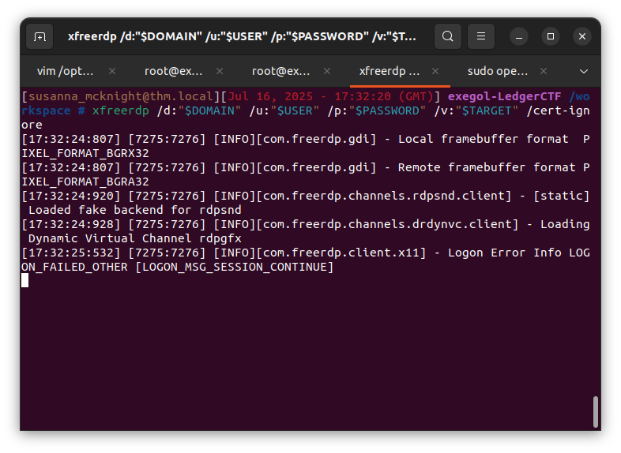</a></p>

We retrieve the `user.txt` flag

<p align="center"><a href="../../images/Ledger/user_txt.png">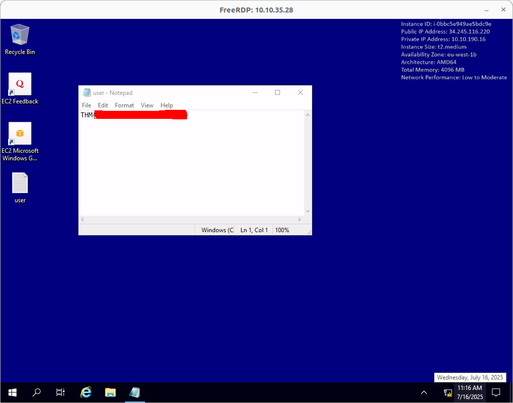</a></p>

***

### 7. PrivEsc – Privilege Escalation via Certificates 🧩

We explore the groups to which Susanna belongs and... oh:

<p align="center"><a href="../../images/Ledger/group.png">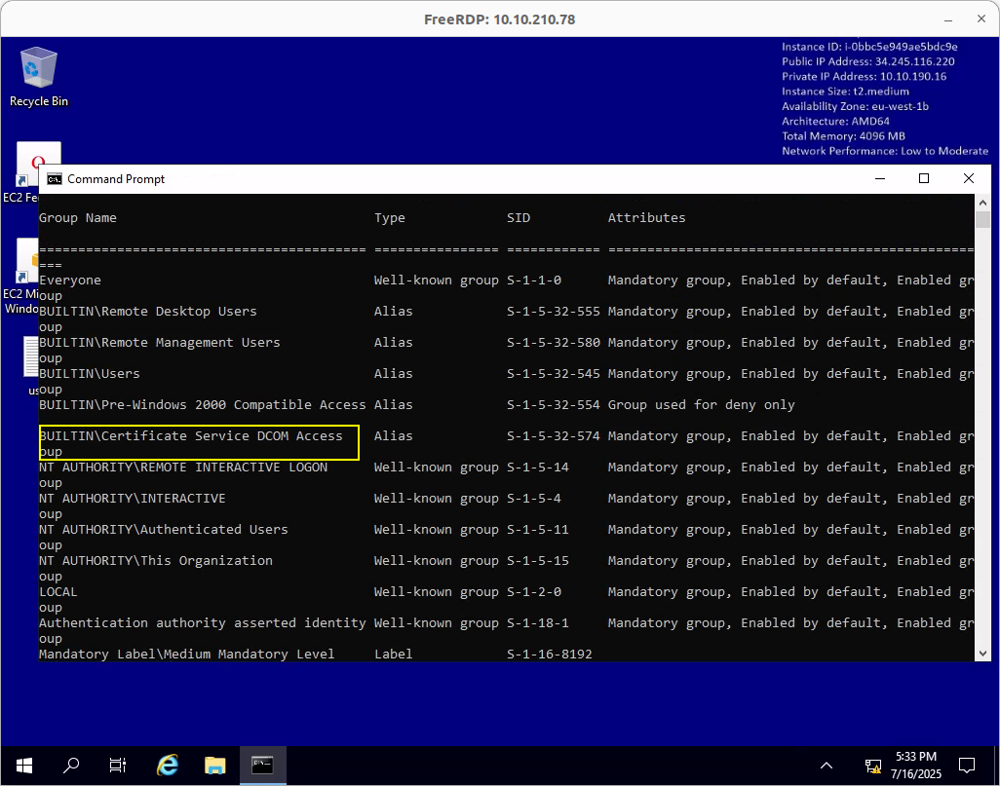</a></p>

`Certificate Service DCOM Access`

🧠 Think: Does this give you leverage over Windows certificate services? You might be able to request a machine authentication certificate...

Using Certipy, a powerful tool for this universe:

<p align="center"><a href="../../images/Ledger/certipy_find.png">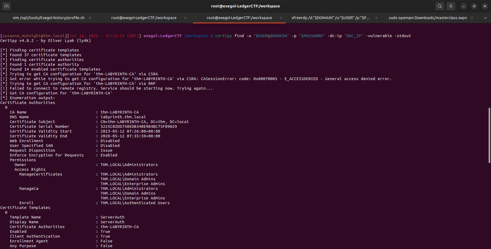</a></p>

<p align="center"><a href="../../images/Ledger/template_vuln.png">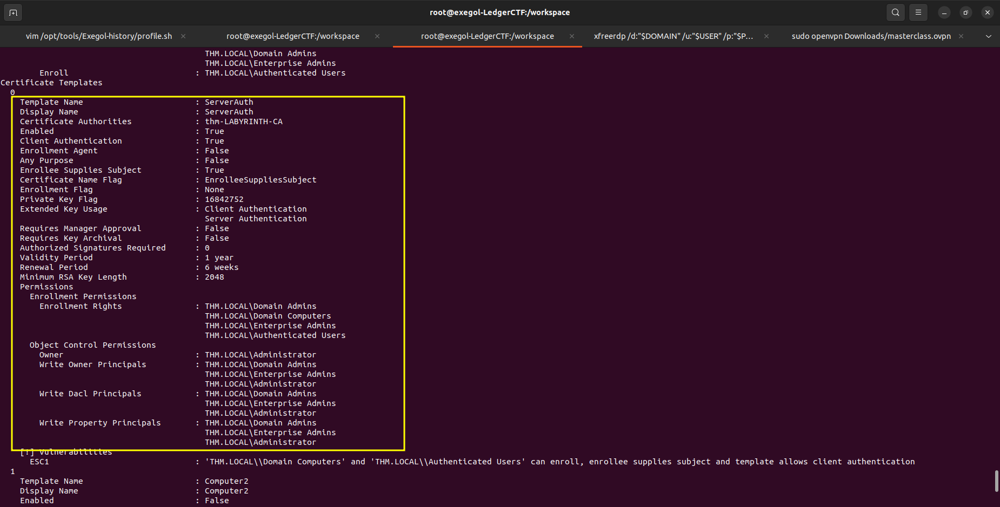</a></p>

A vulnerable template is discovered! We then attempt:

<p align="center"><a href="../../images/Ledger/certipy_req.png">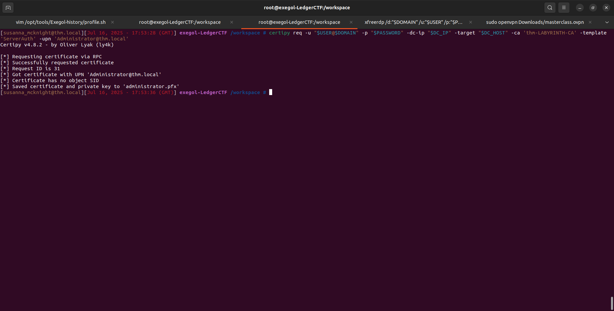</a></p>

We obtain a certificate that allows us to authenticate as Administrator 😈

<p align="center"><a href="../../images/Ledger/certipy_auth.png">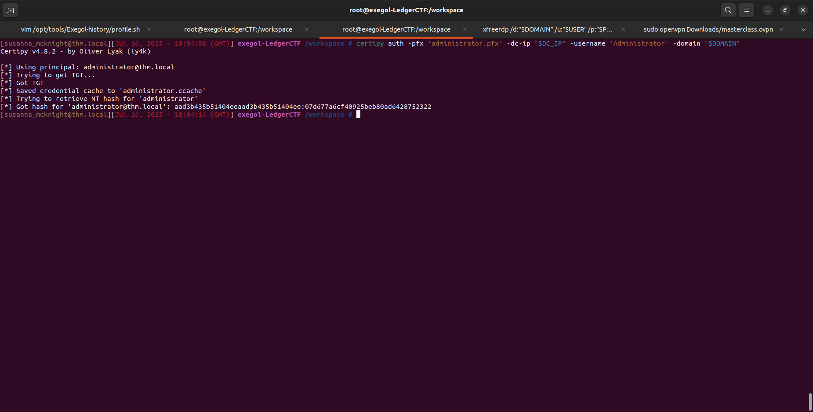</a></p>

And there we have an Administrator TGT. The key to the kingdom.

***

### 8. Admin Connection – The Loop is Closed

With a valid TGT, a wmiexec.py from Impacket gives us a direct shell as admin:

<p align="center"><a href="../../images/Ledger/root.txt.png">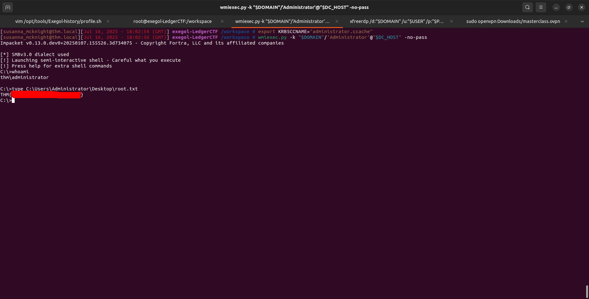</a></p>

And the Grail awaits us!

***

#### Conclusion

This challenge is an excellent example of a realistic Active Directory scenario:

Passive reconnaissance (DNS, LDAP, Nmap)

Exploitation of bad practices (default passwords)

Escalation via ADCS (Active Directory Certificate Services)

***

## Français

**Catégorie :** Active Directory\
**Plateforme :** TryHackMe\
**Objectif :** La machine **Ledger** simule un environnement Active Directory dans lequel l’attaquant doit énumérer des utilisateurs via LDAP, exploiter des mots de passe par défaut pour obtenir un premier accès utilisateur, puis élever ses privilèges en abusant d’une mauvaise configuration d’Active Directory Certificate Services (ADCS). L’objectif final est d’obtenir un certificat permettant de s’authentifier comme **Administrator**.

***

### 1. Scan Nmap – Que nous réserve l'infrastructure ?

Avant de sauter sur les outils les plus sexy, on reste sobre : un bon vieux scan Nmap pour poser les fondations de notre compréhension.

```bash
nmap -sC -sV -Pn -T4 -p- <IP>
```

<p align="center"><a href="../../images/Ledger/nmap_output.png"></a></p>

***

#### **1.1 Exegol-history**

`exegol-history` est un mécanisme ou module souvent utilisé dans l’environnement Exegol, un conteneur Docker offensif conçu pour les pentesters et Red Teamers. Il permet, entre autres, de personnaliser la session de travail dans le conteneur, notamment via le chargement de variables d’environnement dès l’ouverture d’un terminal Exegol.

L’intérêt principal est de pré-configurer automatiquement des variables sensibles ou utiles à chaque engagement, comme :

```
TARGET : nom ou IP de la cible

DOMAIN : domaine Active Directory attaqué

USERNAME : compte compromis durant le pentest

PASSWORD : mot de passe du compte associé

... 
```

<p align="center"><a href="../../images/Reset/exegol_history.png"></a></p>

Cela évite de devoir les retaper à chaque fois, permet de les utiliser dans des scripts ou des outils (NetExec, Impacket, etc.), et standardise l’environnement d’un opérateur à l’autre.

***

**📡 Ports ouverts – Analyse initiale**

Voici les ports détectés par Nmap, avec une analyse rapide des opportunités potentielles :

| Port | Service  | Interprétation / Action                       |
| ---- | -------- | --------------------------------------------- |
| 53   | DNS      | 🔎 **Zone transfer** à tester                 |
| 80   | HTTP     | 🌐 **Investigation web** (site classique ?)   |
| 88   | Kerberos | 🔓 **ASREPRoasting** si usernames connus      |
| 135  | RPC      | 📤 Enumération via **rpcdump**                |
| 139  | NetBIOS  | 📂 Enumération avec **smbmap**/**enum4linux** |
| 445  | SMB      | 📂 Possibles partages, droits, Enum SMB       |
| 389  | LDAP     | 🧬 **ldapsearch** pour extraire des comptes   |
| 443  | HTTPS    | 🌐 **Version sécurisée du site**, à fouiller  |
| 3389 | RDP      | 🔐 **Accès distant** si compte valide         |

On fuite:

* Le Domain name --> `thm.local`
* Le FQDN de la machine --> `labyrinth.thm.local`

### 2. DNS – Peut-on aspirer des infos facilement ?

Un petit test de zone transfer, souvent négligé mais parfois très parlant :

<p align="center"><a href="../../images/Ledger/dig.png"></a></p>

❌ Échec.

Pas grave, on poursuit notre chasse aux infos ailleurs.

***

### 3. HTTP/HTTPS – Espoir sur le web ?

Direction le port 80 (HTTP) puis 443 (HTTPS). L’accès renvoie une page par défaut IIS.

<p align="center"><a href="../../images/Ledger/IIS.png"></a></p>

***

### 4. SMB/RPC – Partages juteux ?

<p align="center"><a href="../../images/Ledger/enum4linux.png"></a></p>

❌ Rien d’exploitable. On dirait qu’il faut être authentifié pour obtenir quelque chose. Revenons plus tard.

***

### 5. LDAP – La perle rare ?

<p align="center"><a href="../../images/Ledger/ldapsearch.png"></a></p>

On grep l'output avec `description`

<p align="center"><a href="../../images/Ledger/ldapdump.png"></a></p>

Puis en descendant un peu on remarque:

<p align="center"><a href="../../images/Ledger/ldapdump_description.png"></a></p>

On extrait les users associés à ce mot de passe par défaut

<p align="center"><a href="../../images/Ledger/ldapdump_users.png"></a></p>

💥 Bingo ! Deux utilisateurs apparaissent avec le même mot de passe par défaut:

```
IVY_WILLIS

SUSANNA_MCKNIGHT
```

***

### 6. RDP – Une ouverture vers le système ?

On teste la possibilité que les users trouvé précédemment puissent se connecter en RDP:

<p align="center"><a href="../../images/Ledger/nxc_fail.png"></a></p>

<p align="center"><a href="../../images/Ledger/nxc_success.png"></a></p>

Puis on se connecte avec le user qui peut établir une session RDP avec la machine

<p align="center"><a href="../../images/Ledger/rdp.png"></a></p>

On récupère le flag `user.txt`

<p align="center"><a href="../../images/Ledger/user_txt.png"></a></p>

***

### 7. PrivEsc – L’escalade par les certificats 🧩

On explore les groupes auxquels Susanna appartient et… oh :

<p align="center"><a href="../../images/Ledger/group.png"></a></p>

`Certificate Service DCOM Access`

🧠 Réfléchis : Cela te donne-t-il un levier sur les services de certificats Windows ? Tu peux peut-être demander un certificat d’authentification machine...

Utilisation de Certipy, un outil redoutable pour cet univers :

<p align="center"><a href="../../images/Ledger/certipy_find.png"></a></p>

<p align="center"><a href="../../images/Ledger/template_vuln.png"></a></p>

Un template vulnérable est découvert ! On tente alors :

<p align="center"><a href="../../images/Ledger/certipy_req.png"></a></p>

On obtient un certificat qui permet de s’authentifier comme Administrator 😈

<p align="center"><a href="../../images/Ledger/certipy_auth.png"></a></p>

Et voilà un TGT Administrator en poche. La clé du royaume.

***

### 8. Connexion Admin – La boucle est bouclée

Avec un TGT valide, un wmiexec.py de Impacket nous donne un shell direct en tant qu’admin :

<p align="center"><a href="../../images/Ledger/root.txt.png"></a></p>

Et le Graal nous attend !

***

#### Conclusion

Ce challenge est un excellent exemple d’un scénario réaliste d'Active Directory :

```
Reconnaissance passive (DNS, LDAP, Nmap)

Exploitation de mauvaises pratiques (mots de passe par défaut)

Escalade via ADCS (Active Directory Certificate Services)
```
