# Reset Write-up (FR/EN)

[🇫🇷 Version française](reset.md#francais) | [🇬🇧 English version](reset.md#english)

### English

**Category:** Active Directory **Platform:** TryHackMe **Objective:** Gain access to a Domain Admin account on a Windows machine by analyzing the Active Directory infrastructure, capturing hashes, identifying attack paths, and exploiting misconfigured Kerberos delegation.

***

#### 1. Initial Scan with Nmap

As always, we start with basic mapping. What services are running on this machine? Which ports are exposed? We run a full scan with Nmap:

```bash
nmap -sC -sV -Pn -T4 -p- "\$TARGET"
```

[](../../docs/images/Reset/nmap.png)

A few points to note here:

| Point                                 | Description                                                                      |
| ------------------------------------- | -------------------------------------------------------------------------------- |
| Port **53 (DNS)** is open             | Is a zone transfer possible?                                                     |
| Port **88 (Kerberos)** is accessible  | Could there be users vulnerable to **AS-REP Roasting**?                          |
| Ports **135 / 139 / 445 (RPC / SMB)** | Could give us access to shares                                                   |
| **RDP (3389)** and **WinRM (5985)**   | Require credentials but become very useful once we have a foothold in the domain |

Note that the Nmap scan allowed us to leak:

* The domain: `thm.corp`
* The FQDN of the machine: `HayStack.thm.corp`

***

**1.1 Exegol-history**

`exegol-history` is a mechanism or module often used in the Exegol environment, an offensive Docker container designed for pentesters and Red Teamers. It allows, among other things, customization of the working session in the container, particularly through the loading of environment variables as soon as an Exegol terminal is opened.

The main benefit is the automatic pre-configuration of sensitive or useful variables for each engagement, such as:

* TARGET: name or IP of the target
* DOMAIN: Active Directory domain under attack
* USERNAME: account compromised during the pentest
* PASSWORD: password of the associated account
* ...

[](../../docs/images/Reset/exegol_history.png)

This avoids having to retype them each time, allows their use in scripts or tools (NetExec, Impacket, etc.), and standardizes the environment from one operator to another.

***

#### 2. DNS Zone Transfer

First reflex in the presence of DNS: test a **zone transfer**.

[](../../docs/images/Reset/dns_zone_transfer.png)

Unfortunately, the operation fails.

***

#### 3. SMB Enumeration

Let's move on to the SMB ports. We use **enum4linux** to extract as much information as possible about the domain and shares.

[](../../docs/images/Reset/enum4linux.png) [](../../docs/images/Reset/shares_enum4linux.png) A share named **Data** is accessible. We confirm the presence and restrictions of this share with smbmap. [](../../docs/images/Reset/smbmap.png)

A connection via `smbclient` allows browsing its contents.

[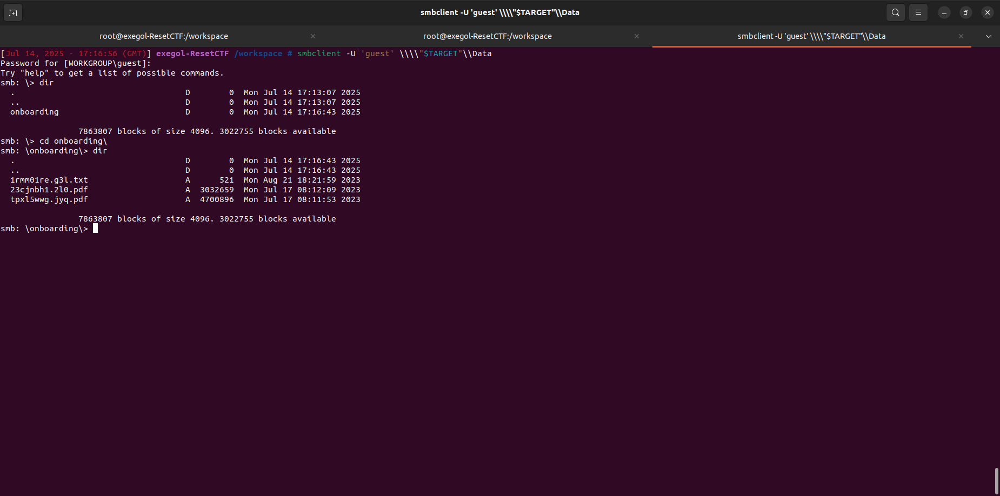](../../docs/images/Reset/smb_shares.png)

Strange thing: the file names change regularly. This suggests an automatic process in the background. Maybe a **service account**?

[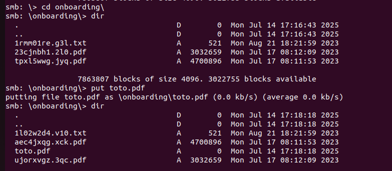](../../docs/images/Reset/changement_nom_fichiers.png)

This behavior deserves to be provoked... and taken advantage of.

***

#### 4. NTLM Hash Capture via Responder

The goal here is to capture an **NTLM hash** via an **SMB relay/capture** attack.

* We generate trapped files with **ntlm\_theft** (various extensions)

[](../../docs/images/Reset/ntlm_theft.png) [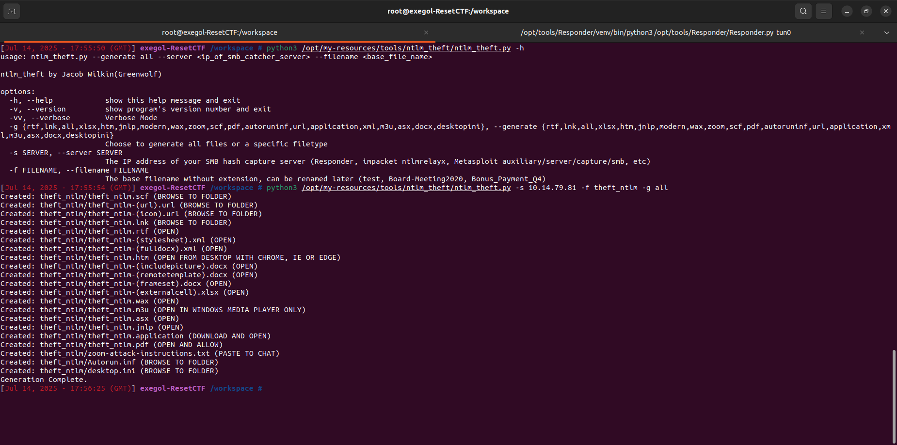](../../docs/images/Reset/genrate_file_ntlm_theft.png)

* We upload them to the share

[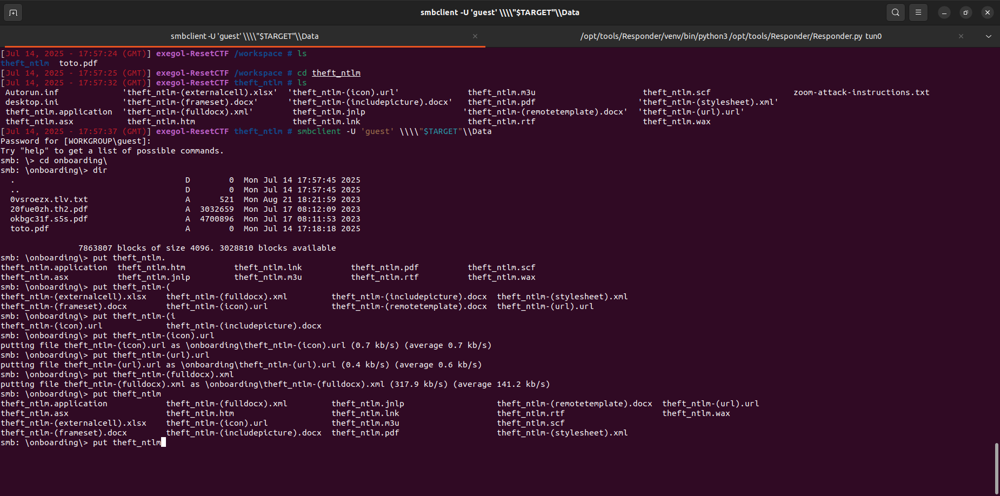](../../docs/images/Reset/upload_file.png)

* We launch **Responder** in listening mode

[](../../docs/images/Reset/responder.png)

When a service (such as an automated account) interacts with these files, it sends its credentials in NTLM format.

[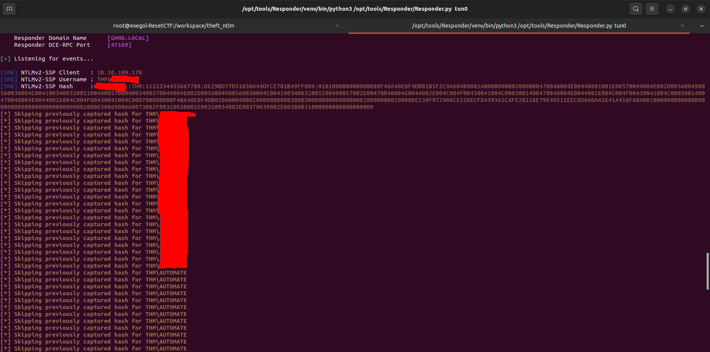](../../docs/images/Reset/get_nt_hash.png)

At this stage, ask yourself the question: why is this service interacting with my files ? What role does it play in the AD environment ?

***

#### 5. NTLM Hash Cracking and Initial Access

Once the hash is retrieved, head to **John the Ripper** to brute force it.

[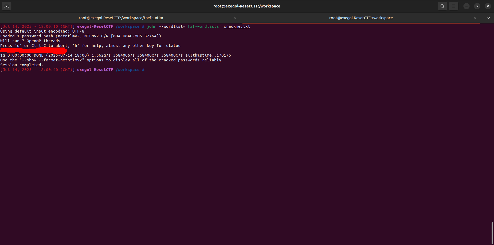](../../docs/images/Reset/crack_hash1.png)

Once the password is discovered, an **Evil-WinRM** session allows connecting to the machine.

[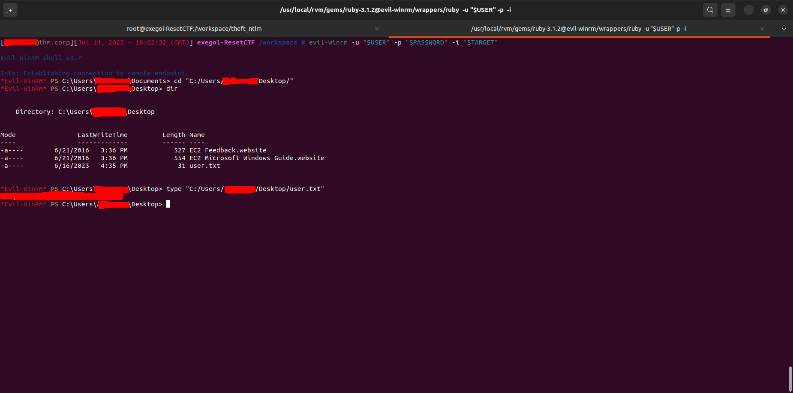](../../docs/images/Reset/evil-winRM_+_user_flag.png)

First flag: `user.txt`. But above all, the first anchor point in the environment. It is time to look up and observe the AD infrastructure as a whole.

***

#### 6. Active Directory Reconnaissance with BloodHound

To analyze the Active Directory environment, we use **BloodHound**. This step is crucial to identify access relationships, implicit permissions, and misconfigurations.

The steps:

* Launch **Neo4j**

```bash
neo4j console
```

* Launch the BloodHound collector from the Imapcket suite

[](../../docs/images/Reset/bloodhound_collector.png)

* Load the data into BloodHound and observe

[](../../docs/images/Reset/import_bloodhound.png)

Questions to ask yourself here:

* Who has access to what?
* Which permissions can be abused?
* Is there a path to higher privileges?

***

#### 7. Lateral Movement via AS-REP Roasting

BloodHound allows identifying accounts vulnerable to **AS-REP Roasting**.

[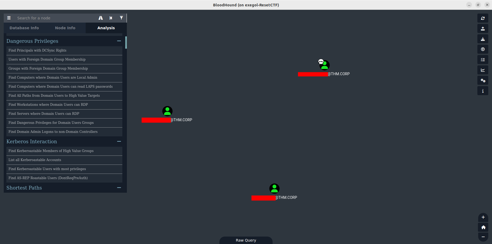](../../docs/images/Reset/AS-REProast_users.png)

We identify **three users** who do not have pre-authentication enabled. This is an opportunity not to be missed.

We retrieve the encrypted TGT tickets, then submit them to John the Ripper.

[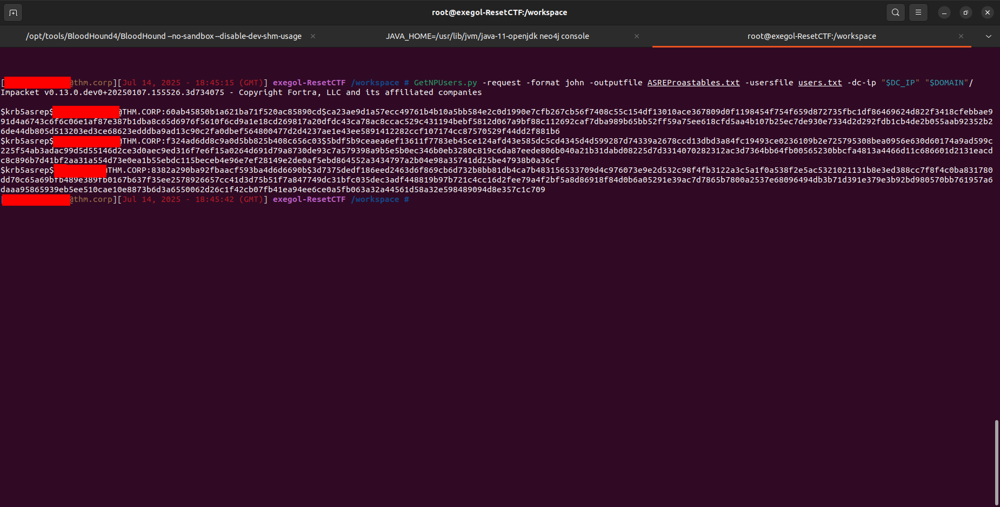](../../docs/images/Reset/Get-NPUsers.png)

[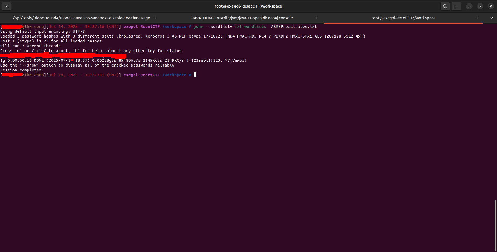](../../docs/images/Reset/crack_hash2.png)

A password is cracked.

**Think:** Why don’t these accounts have pre-authentication enabled? Is it negligence or a deliberate configuration?

***

#### 8. Privilege Abuse via Reset Password

By analyzing more deeply with BloodHound, we discover that the user whose password we just cracked has the right to reset the password of an account that, in turn, has the right to reset the password of another account, and so on.

[](../../docs/images/Reset/kill_chain.png)

This is an escalation chain:

1. Reset the password of a first account
2. Use it to compromise another account
3. Repeat until you reach an interesting account

***

#### 9. Kerberos Delegation (Constrained)

The last obtained account has **AllowedToDelegateTo** delegation rights.\
This is known as **constrained Kerberos delegation**, and it is particularly dangerous if misconfigured.

[](../../docs/images/Reset/kerberos_delegations.png)

With these rights, it is possible to forge a **Service Ticket** for the `cifs` service on behalf of **Administrator**.

[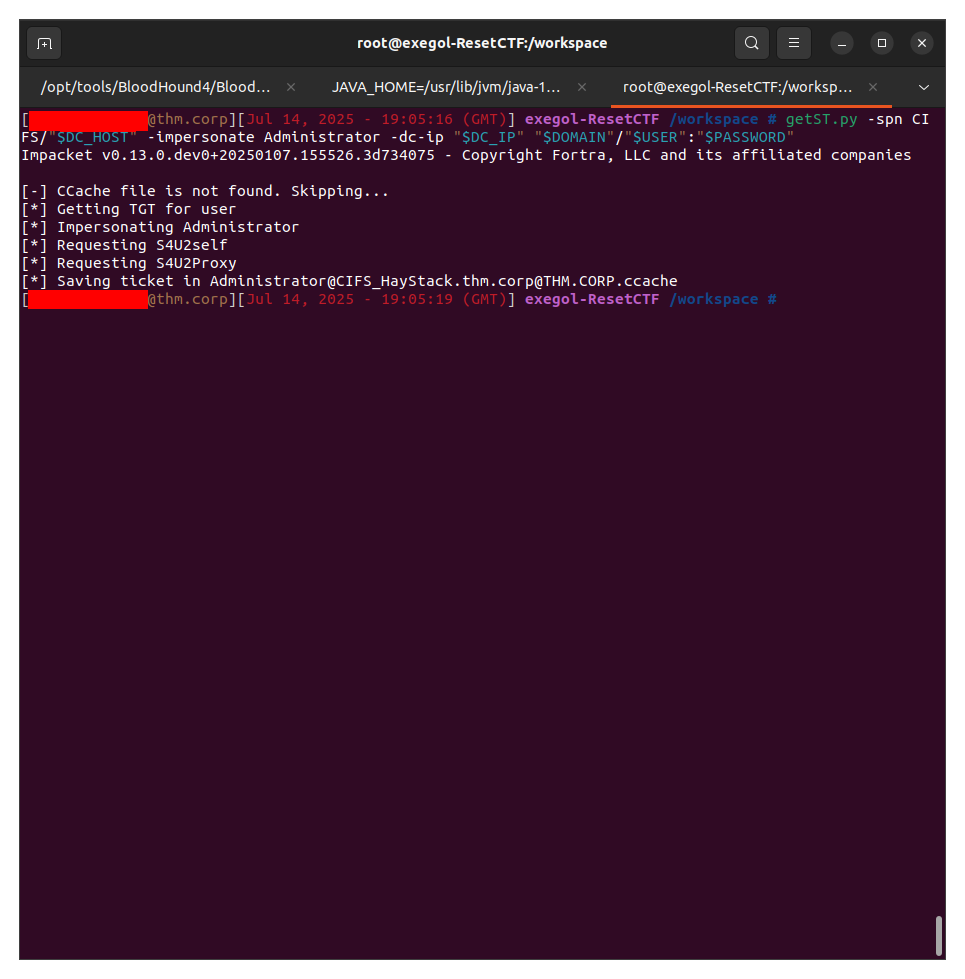](../../docs/images/Reset/getST.png)

***

#### 10. Access to the Administrator Account

The ST is forged and exported as an environment variable.

All that remains is to connect using **wmiexec.py** or an equivalent tool.

[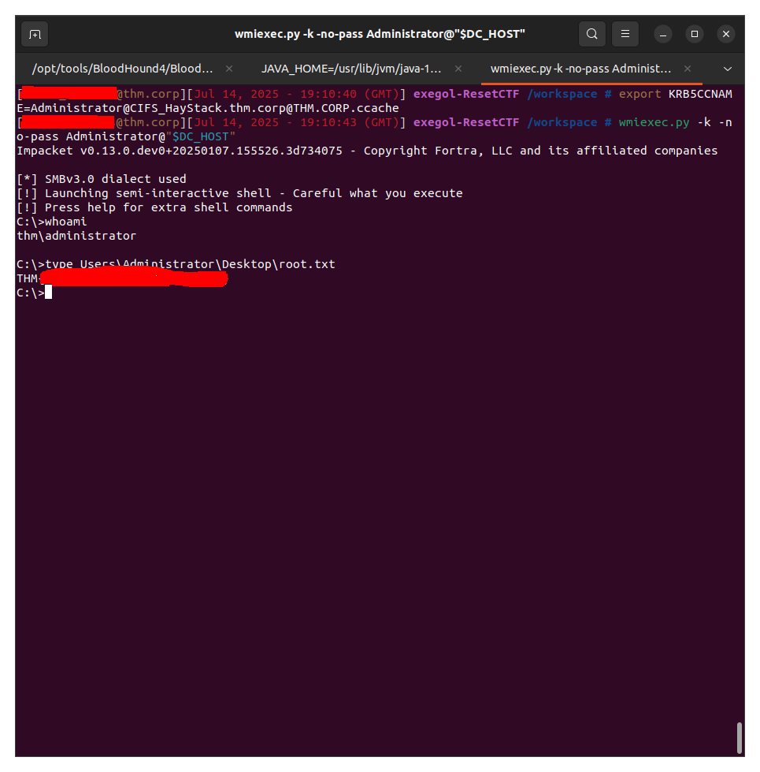](../../docs/images/Reset/root.txt.png)

We gain access to the machine with **Domain Admin** rights.\
And we retrieve the final flag: `root.txt`.

***

🎯 **Final Thought:**\
This machine clearly shows how **several small combined weaknesses** (AS-REP Roasting, poorly managed permissions, Kerberos delegation) can lead to a full domain compromise.

Each step may not be critical on its own, but together, they pave the way to full escalation.

***

### Français

**Catégorie :** Active Directory\
**Plateforme :** TryHackMe\
**Objectif :** Accéder à un compte Domain Admin sur une machine Windows en analysant l'infrastructure Active Directory, capturant des hash, identifiant les chemins d'attaque et exploitant les mauvaises configurations de délégation Kerberos.

***

#### 1. Scan initial avec Nmap

Comme toujours, on commence par une cartographie de base. Quels services tournent sur cette machine ? Quels ports sont exposés ? On exécute un scan complet avec Nmap :

```bash
nmap -sC -sV -Pn -T4 -p- "$TARGET"
```

[](../../docs/images/Reset/nmap.png)

Quelques points à noter ici :

* Le port **53 (DNS)** est ouvert. Est-ce qu’un transfert de zone est possible ?
* Le port **88 (Kerberos)** est accessible. Pourrait-il y avoir des utilisateurs vulnérables au **AS-REP Roasting** ?
* Les ports **135 / 139 / 445 (RPC / SMB)** pourraient nous donner accès à des partages.
* Le **RDP (3389)** et **WinRM (5985)** nécessitent des identifiants, mais deviennent très utiles une fois qu’on a un pied dans le domaine.

A noter que le scan nmap nous a permis de fuiter:

* le domain : `thm.corp`
* le FQDN de la machine: `HayStack.thm.corp`

***

**1.1 Exegol-history**

`exegol-history` est un mécanisme ou module souvent utilisé dans l’environnement Exegol, un conteneur Docker offensif conçu pour les pentesters et Red Teamers. Il permet, entre autres, de personnaliser la session de travail dans le conteneur, notamment via le chargement de variables d’environnement dès l’ouverture d’un terminal Exegol.

L’intérêt principal est de pré-configurer automatiquement des variables sensibles ou utiles à chaque engagement, comme :

```
TARGET : nom ou IP de la cible

DOMAIN : domaine Active Directory attaqué

USERNAME : compte compromis durant le pentest

PASSWORD : mot de passe du compte associé

... 
```

[](../../docs/images/Reset/exegol_history.png)

Cela évite de devoir les retaper à chaque fois, permet de les utiliser dans des scripts ou des outils (NetExec, Impacket, etc.), et standardise l’environnement d’un opérateur à l’autre.

***

#### 2. Transfert de zone DNS

Premier réflexe en présence de DNS : tester un **zone transfer**.

[](../../docs/images/Reset/dns_zone_transfer.png)

Malheureusement, l’opération échoue.

***

#### 3. Énumération SMB

Passons aux ports SMB. On utilise **enum4linux** pour extraire un maximum d’informations sur le domaine et les partages.

[](../../docs/images/Reset/enum4linux.png) [](../../docs/images/Reset/shares_enum4linux.png) Un partage nommé **Data** est accessible.\
On confirme la présence et les restrictions de ce partage ave smbmap [](../../docs/images/Reset/smbmap.png)

Une connexion via `smbclient` permet de parcourir son contenu.

[](../../docs/images/Reset/smb_shares.png)

Chose étrange : les noms de fichiers changent régulièrement. Cela évoque un processus automatique en arrière-plan. Peut-être un **compte de service** ?

[](../../docs/images/Reset/changement_nom_fichiers.png)

Ce comportement mérite qu'on le provoque... et qu'on en profite.

***

#### 4. Capture de hash NTLM via Responder

L’objectif ici est de capturer un **hash NTLM** via une attaque de type **SMB relay / capture**.

* On génère des fichiers piégés avec **ntlm\_theft** (diverses extensions)

[](../../docs/images/Reset/ntlm_theft.png) [](../../docs/images/Reset/genrate_file_ntlm_theft.png)

* On les upload dans le partage

[](../../docs/images/Reset/upload_file.png)

* On lance **Responder** en écoute

[](../../docs/images/Reset/responder.png)

Quand un service (comme un compte automatisé) interagit avec ces fichiers, il envoie ses identifiants au format NTLM.

[](../../docs/images/Reset/get_nt_hash.png)

À ce stade, pose-toi la question : pourquoi ce service interagit-il avec mes fichiers ? Quel rôle joue-t-il dans l’environnement AD ?

***

#### 5. Crackage du hash NTLM et accès initial

Une fois le hash récupéré, direction **John the Ripper** pour le bruteforce.

[](../../docs/images/Reset/crack_hash1.png)

Une fois le mot de passe découvert, une session **Evil-WinRM** permet de se connecter à la machine.

[](../../docs/images/Reset/evil-winRM_+_user_flag.png)

Premier drapeau : `user.txt`.\
Mais surtout, premier point d’ancrage dans l’environnement. Il est temps de lever la tête et d’observer l’infrastructure AD dans son ensemble.

***

#### 6. Reconnaissance Active Directory avec BloodHound

Pour analyser l’environnement Active Directory, on utilise **BloodHound**.\
Cette étape est cruciale pour identifier les relations d’accès, les permissions implicites et les mauvaises configurations.

Les étapes :

* Lancer **Neo4j**

```bash
neo4j console
```

* Lancer le collecteur **BloodHound** de la suite Imapcket

[](../../docs/images/Reset/bloodhound_collector.png)

* Charger les données dans BloodHound et observer

[](../../docs/images/Reset/import_bloodhound.png)

Questions à se poser ici :

* Qui a accès à quoi ?
* Quelles permissions sont abusables ?
* Existe-t-il un chemin vers des privilèges plus élevés ?

***

#### 7. Mouvement latéral via AS-REP Roasting

BloodHound permet d'identifier les comptes vulnérables à **AS-REP Roasting**.

[](../../docs/images/Reset/AS-REProast_users.png)

On repère **trois utilisateurs** qui n’ont pas la pré-authentification activée. C’est une opportunité à ne pas rater.

On récupère les tickets TGT chiffrés, puis on les soumet à John the Ripper.

[](../../docs/images/Reset/Get-NPUsers.png)

[](../../docs/images/Reset/crack_hash2.png)

Un mot de passe tombe.

**Réfléchis :** Pourquoi ces comptes n’ont-ils pas de pré-authentification ? Est-ce une négligence ou une configuration volontaire ?

***

#### 8. Abus de privilèges via Reset Password

En analysant plus profondément avec BloodHound, on découvre que l'utilisateur dont on vient de cracker le mot de passe a le droit de réinitialiser le mot de passe d'un compte qui a son toura le droit de réinitialiser le mot de passe d'un compte, etc.

[](../../docs/images/Reset/kill_chain.png)

C’est une chaîne d’escalade :

1. Réinitialiser le mot de passe d’un premier compte
2. S’en servir pour en compromettre un autre
3. Répéter jusqu’à tomber sur un compte intéressant

***

#### 9. Délégation Kerberos (contrainte)

Le dernier compte obtenu possède des droits de délégation **AllowedToDelegateTo**.\
C’est ce qu’on appelle de la **délégation Kerberos contrainte**, et c’est particulièrement dangereux si mal configuré.

[](../../docs/images/Reset/kerberos_delegations.png)

Avec ces droits, il est possible de forger un **Service Ticket** pour le service `cifs` au nom de **Administrator**.

[](../../docs/images/Reset/getST.png)

***

#### 10. Accès au compte Administrator

Le ST est forgé et exporté comme variable d’environnement.

Il ne reste plus qu’à se connecter avec **wmiexec.py** ou un équivalent.

[](../../docs/images/Reset/root.txt.png)

On accède à la machine avec les droits **Domain Admin**.\
Et on récupère le flag final : `root.txt`.

***

🎯 **Réflexion finale :**\
Cette machine montre bien comment **plusieurs petites faiblesses combinées** (AS-REP Roasting, permissions mal maîtrisées, délégation Kerberos) peuvent conduire à une compromission complète du domaine.

Chaque étape n’est pas forcément critique seule, mais ensemble, elles ouvrent un chemin vers l’escalade maximale.
